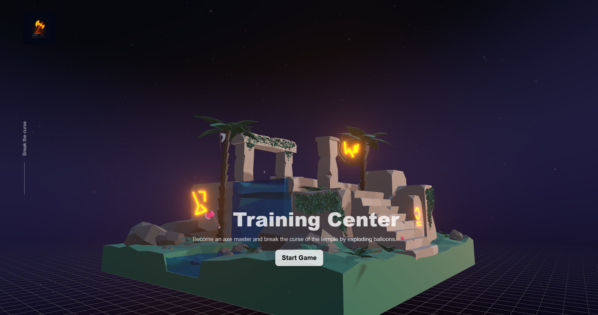

# 🪓 Axe Mastery - Temple of the Ancient Axe

[](https://axe-mastery.vercel.app/)

Axe Mastery is a stylized, physics-driven throwing game set within a mystical ruin infused with ancient energy and dynamic visuals. Players step into a rune-bound training ground, where floating balloons and a sacred target put their aim to the test. With only three axes per round, precision matters - hit moving balloons and the glowing sigil to rack up points, accompanied by immersive sound effects and reactive VFX. Spark bursts, rising stardust, and fluid physics breathe life into every throw, making this more than just a game - it's a trial of skill in a world alive with motion and magic.

## ✨ Key Features:

- **🧭 3-Round Skill Challenge**: Limited axe throws per round make every shot count.
- **💥 Real-Time VFX Feedback**: Starry ground fog, reactive spark bursts, and hit flashes powered by ```wawa-vfx```.
- **🔊 Spatial Sound Effects**: Audio cues for throws, collisions, and hits - all synced to user interaction.
- **🎮 Physics-Based Throwing**: Built with ```react-three-rapier``` for realistic axe motion and target impact.
- **🧠 Zustand State Logic**: Tracks score, throw count, and round flow using a lightweight, efficient state system.
- **🌌 Stylized Rune Environment**: A low-poly temple with glowing glyphs, water effects, and an atmospheric night sky.
- **🚀 Powered by R3F Ecosystem**: Built with ```Next.js```, ```react-three-fiber```, ```drei```, ```rapier```, and ```postprocessing``` magic.

## 🛠️ Built With

- [Next.js](https://nextjs.org/) (Frontend Framework)
- HTML & CSS (Structure and Styling)
- JavaScript (Interactivity)
- [Tailwind CSS](https://tailwindcss.com/) (Utility-First CSS Framework)
- [Three.js](https://threejs.org/) (JavaScript 3D Library)
- [React Three Fiber](https://r3f.docs.pmnd.rs/getting-started/introduction) (3D Graphics Library)
- [React Three Drei](https://drei.docs.pmnd.rs/getting-started/introduction) (R3F helpers)
- [React Three Postprocessing](https://react-postprocessing.docs.pmnd.rs/introduction) (Visual effects)
- [React Three Rapier](https://github.com/pmndrs/react-three-rapier) (Physics Engine)
- [Zustand](https://zustand-demo.pmnd.rs/) (State-management Library)
- [Wawa VFX](https://github.com/wass08/wawa-vfx) (VFX library)

## ⚙️ Getting Started

To get a local copy of this project up and running, follow these steps:

### ✅ Prerequisites

Make sure you have Node.js installed.

### 📦 Installation

Clone the repository and install dependencies.

```bash
git clone https://github.com/DV192/axe-mastery.git
cd axe-mastery
npm install
```

### 🧪 Usage

Start the development server.

```bash
npm run dev
```

Visit http://localhost:3000 in your browser.

## 💡 Project Inspiration

This project was created by following the tutorial on [Wawa Sensei YouTube Channel](https://www.youtube.com/@WawaSensei). Special thanks to the creator for the guidance and inspiration.

## 🚀 Deployment

This project is deployed on [Vercel](https://vercel.com/). Visit the live version [here](https://axe-mastery.vercel.app/).